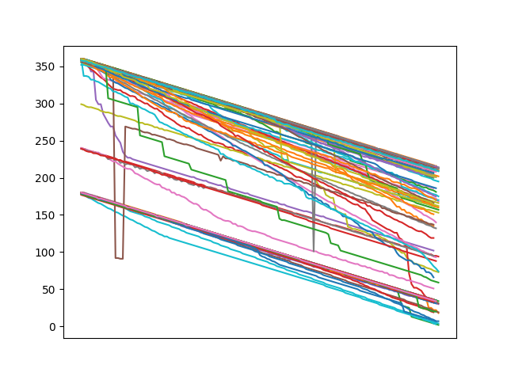

# Academy-Course-PYT37067
Processing Agency Mortgage Data with Awk, Pandas and Django - Part 2: Performing Book

This [crash course](https://www.openriskacademy.com/course/view.php?id=67) illustrates how to process loan-level US Agency mortgage data using awk, pandas and django. The second part of the course focuses on performing book attributes. It requires familiarity with command line tools (Ideally a linux environment) and Python. The repository includes various scripts used in the course.

Please Note: Replicating the data processing steps on an actual Fannie Mae dataset <i>requires</i> the Academy student to download such data themselves from the Data Dynamics website and abide with their terms and conditions.

<h4>Course Level and Type:</h4>
<table summary="Course classification table" class="table-factsheet" cellspacing="5" cellpadding="5" border="1"
       align="left">
    <tbody>
    <tr>
        <td></td>
        <td><b>Introductory Level</b></td>
        <td><b>Core Level</b></td>
        <td><b>Advanced Level</b></td>
    </tr>
    <tr>
        <td><b>Non-Technical</b></td>
        <td></td>
        <td></td>
        <td></td>
    </tr>
    <tr>
        <td><b>Technical</b></td>
        <td></td>
        <td bgcolor="#EC9126">CrashProgram PYT37067</td>
        <td></td>
    </tr>
    </tbody>
</table>
